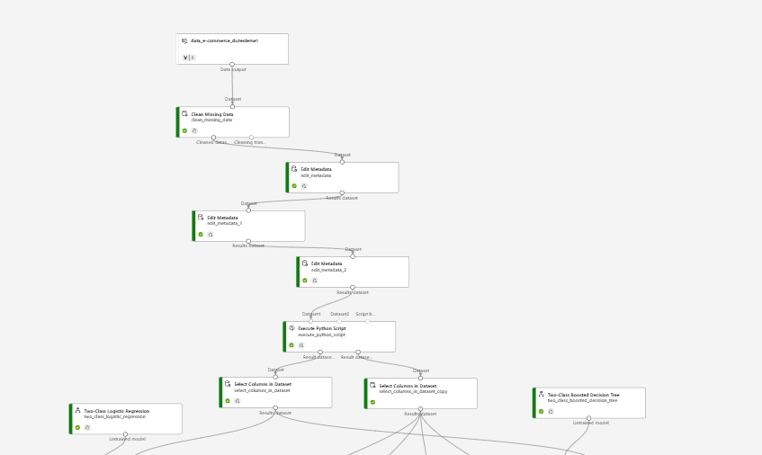
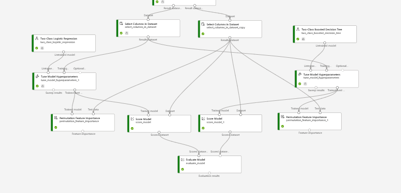
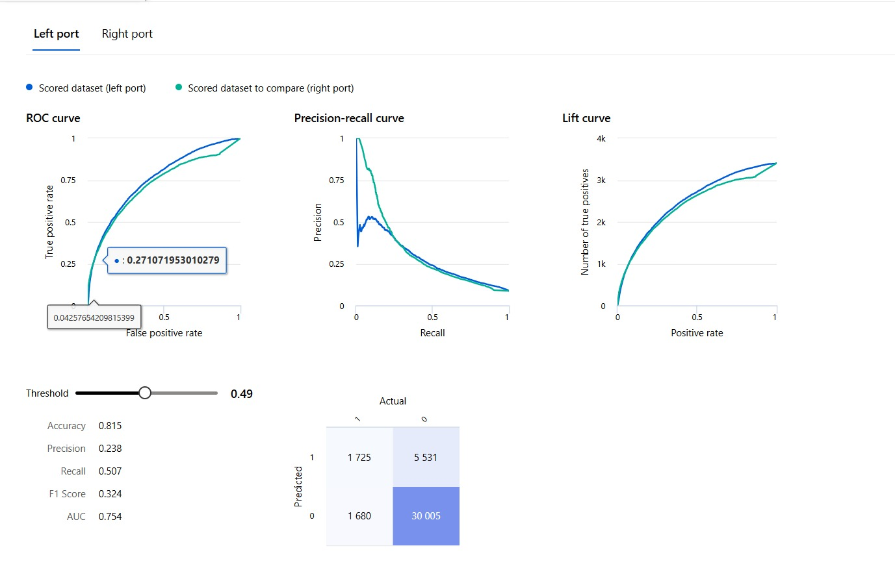
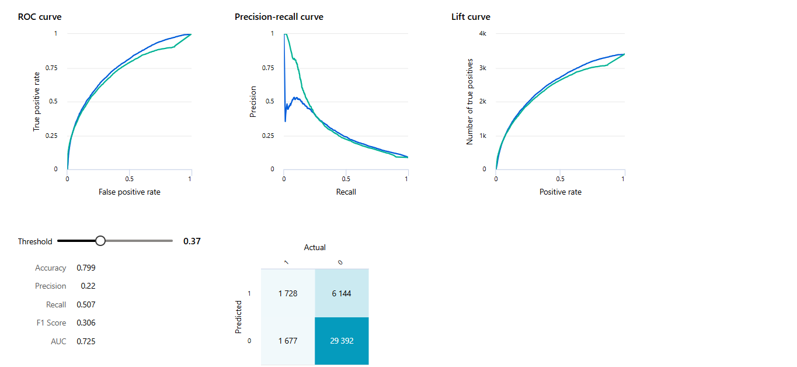
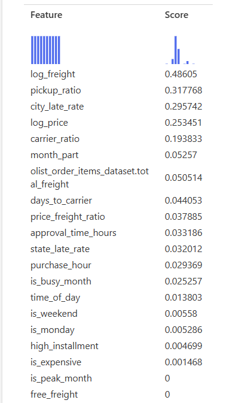
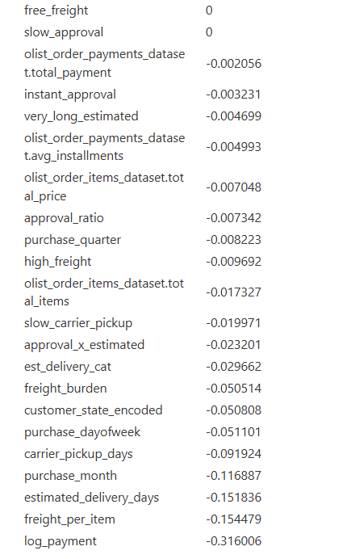
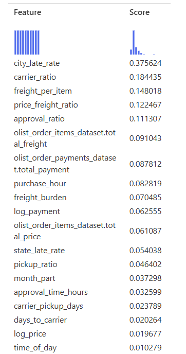
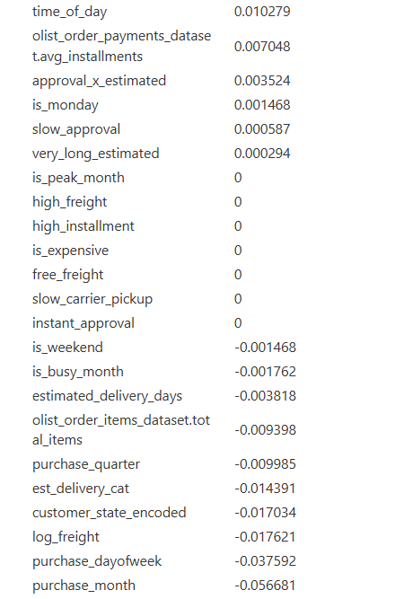

# E-Ticaret Teslimat Gecikme Tahmin Modeli

Azure ML Pipeline ile ikili sınıflandırma kullanılarak, bir siparişin kargoya verildiği anda teslimatta gecikme olup olmayacağını tahmin eden makine öğrenmesi projesi.

## Veri Seti

**Olist E-Ticaret (Brezilya)** — 96.470 sipariş | 2016–2018 | %8,1 gecikme oranı

Gecikmeli siparişlerde ortalama teslimat süresi 31,1 gün; zamanında teslimatta ise 10,4 gün — gecikmeli siparişler yaklaşık 3 kat daha uzun sürüyor.

## Problem Tanımı

Bir sipariş kargoya verildiği anda teslimatın gecikip gecikmeyeceğini önceden tahmin etmek, şu alanlarda değer yaratır:

- Proaktif müşteri bildirimi
- Lojistik operasyonların optimizasyonu
- İade maliyetlerinin azaltılması
- Müşteri sadakatinin korunması
- Tedarik zinciri darboğazlarının tespiti

## Yöntem

Kronolojik train/test split kullanıldı (eski verilerle eğitim, yeni verilerle test) — bu sayede veri sızıntısı (data leakage) riski ortadan kaldırıldı ve gerçek dünya senaryosu simüle edildi.

**Anahtar özellikler:** `city_late_rate`, `carrier_ratio`, `freight_per_item`, `log_freight`, `approval_ratio`, `price_freight_ratio`

**Hedef değişken (`is_late`):** Teslim tarihi, tahmini teslim tarihini geçtiyse 1, geçmediyse 0.

İki model Azure ML Studio üzerinde paralel olarak eğitildi:

- **Two-Class Logistic Regression** — lineer karar sınırı, yorumlanabilir katsayılar (baseline model)
- **Two-Class Boosted Decision Tree** — zayıf öğrenicilerin ardışık kombinasyonu, doğrusal olmayan ilişkileri yakalar

## Sonuçlar

| Metrik | Logistic Regression | Boosted Decision Tree |
|---|---|---|
| Accuracy | %81,5 | %79,9 |
| Precision | %23,8 | %22,0 |
| Recall | %50,7 | %50,7 |
| F1 Score | %32,4 | %30,6 |
| AUC | 0,754 | 0,725 |
| Threshold | 0,49 | 0,37 |

Logistic Regression, daha yüksek accuracy ve AUC ile daha dengeli ve güvenilir bir genel model sundu. Boosted Decision Tree, düşürülmüş threshold (0,37) ile LR'ye eşit recall (%50,7) yakaladı.

### Logistic Regression Değerlendirme

### Boosted Decision Tree Değerlendirme

## Özellik Önemi (Permutation Feature Importance)

En güçlü sinyaller:

1. **log_freight (0,486)** — Yüksek kargo bedeli, ağır/büyük paketlerle ilişkili ve gecikmeye daha yatkın
2. **pickup_ratio (0,318)** — Kargo firmasının paketi ne hızlı aldığı gecikmeyi doğrudan etkiliyor
3. **city_late_rate (0,296)** — Şehir bazlı gecikme geçmişi her iki modelde de güçlü sinyal
4. **month_part (0,053)** — Ayın başı/ortası/sonu ayrımı, yoğun dönemlerde gecikme riskini yakalıyor

## Çıkarımlar

- RJ eyaletinde gecikme oranı %13,5 — SP eyaletinin 2,3 katı
- `carrier_ratio` hem LR hem BDT'de üst sıralarda: kargo firması seçimi gecikme riskini doğrudan belirliyor
- Model, Azure ML Real-time Endpoint ile üretim ortamına entegre edilmeye hazır

## Gelecek Adımlar

Bu çalışma bir prototip niteliğindedir. İlerleyen aşamalarda:

- XGBoost / LightGBM gibi algoritmalarla model performansı artırılabilir
- Hava durumu ve tatil takvimi gibi ek veri kaynakları eklenebilir
- Azure ML Real-time Endpoint entegrasyonu ile her sipariş anında otomatik müşteri bildirimi gönderen canlı bir sisteme dönüştürülebilir

## Platform

Microsoft Azure Machine Learning Studio

## Proje Sunumu

Detaylı sunum için: [`eticaret_gecikme_tahmini.pptx`](eticaret_gecikme_tahmini.pptx)
